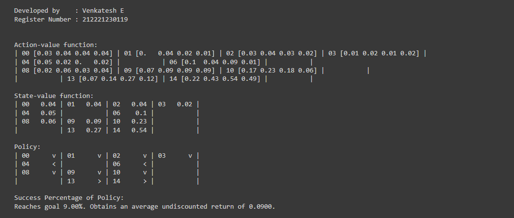

# MONTE CARLO CONTROL ALGORITHM

## AIM
To develop a Python program to find the optimal policy for the given RL environment using the Monte Carlo algorithm.    

## PROBLEM STATEMENT
## PROBLEM STATEMENT
The FrozenLake environment in OpenAI Gym is a gridworld problem that challenges reinforcement learning agents to navigate a slippery terrain to reach a goal state while avoiding hazards. Note that the environment is closed with a fence, so the agent cannot leave the gridworld.

### States
- 5 Terminal States:
    - `G` (Goal): 
      - The state the agent aims to reach. 
      - In this MDP the goal state is `state 0`
    - `H` (Hole): 
      - A hazardous state that the agent must avoid at all costs.
      - In this MDP the goal state is 
        - `state 3`
        - `state 7`
        - `state 8`
        - `state 13`

- 11 Non-terminal States:
    - `S` (Starting state): 
      - The initial position of the agent.
      - In this MDP the goal state is `state 5`
    - `Intermediate states`: Grid cells forming a layout that the agent must traverse.

### Actions
The agent can take 4 actions in each state:
- `LEFT`
- `RIGHT`
- `UP`
- `DOWN`

### Transition Probabilities
The environment is stochastic, meaning that the outcome of an action is not always certain.

- `33.33%` chance of moving in the **intended direction**.
- `66.66%` chance of moving in a **orthogonal directions**.

This uncertainty adds complexity to the agent's navigation.

### Rewards
- `+1` for **reaching the goal** state `G`.
- `0` reward for **all other states**, including the starting state `S` and intermediate states.

### Episode Termination
The episode terminates when the agent reaches the goal state `G` or falls into a hole `H`.

### Graphical Representation.


## MONTE CARLO CONTROL ALGORITHM
1. Initialize the state value function `V(s)` and the policy `π(s)` arbitrarily.
2. Generate an episode using `π(s)` and store the state, action, and reward sequence.
3. For each state `s` appearing in the episode:
    - `G` ← return following the first occurrence of `s`
    - Append `G` to `Returns(s)`
    - `V(s)` ← `average(Returns(s))`
4. For each state s in the episode:
    - `π(s)` ← `argmax_a ∑_s' P(s'|s,a)V(s')`
5. Repeat steps 2-4 until the policy converges.
6. Use the function `decay_schedule` to decay the value of `epsilon` and `alpha`.
7. Use the function `gen_traj` to generate a trajectory.
8. Use the function `tqdm` to display the progress bar.
9. After the policy converges, use the function `np.argmax` to find the optimal policy. The function takes the following arguments:
    - `Q:` The Q-table.
    - `axis:` The axis along which to find the maximum value.

## MONTE CARLO CONTROL FUNCTION
```py
from tqdm import tqdm
def mc_control(env, gamma = 1.0,
               init_alpha = 0.5, min_alpha = 0.01, alpha_decay_ratio = 0.5,
               init_epsilon = 1.0, min_epsilon = 0.1, epsilon_decay_ratio = 0.9,
               n_episodes = 3000, max_steps = 200, first_visit = True):
  nS, nA = env.observation_space.n, env.action_space.n

  discounts = np.logspace(0,max_steps, num=max_steps,
                          base=gamma, endpoint = False)
  alphas = decay_schedule(init_alpha, min_alpha, alpha_decay_ratio, n_episodes)

  epsilons = decay_schedule(init_epsilon, min_epsilon, epsilon_decay_ratio, n_episodes)

  pi_track = []
  Q = np.zeros((nS, nA), dtype = np.float64)
  Q_track = np.zeros((n_episodes, nS, nA), dtype = np.float64)
  select_action = lambda state, Q, epsilon: np.argmax(Q[state]) 

  if np.random.random() > epsilon_decay_ratio else np.random.randint(len(Q[state]))

  for e in tqdm(range(n_episodes), leave = False):
    trajectory = generate_trajectory(select_action, Q, epsilons[e], env, max_steps)
    visited = np.zeros((nS, nA),dtype = bool)

    for t, (state, action, reward, _, _) in enumerate(trajectory):
      state = int(state)
      action = int(action)

      if visited[state][action] and first_visit:
        continue
      visited[state][action] = True
      n_steps = len(trajectory[t:])
      G = np.sum(discounts[:n_steps] * trajectory[t:, 2])
      Q[state][action] += alphas[e] * (G - Q[state][action])
    Q_track[e] = Q
    pi_track.append(np.argmax(Q, axis = 1))
    
  V = np.max(Q, axis = 1)
  pi = lambda s: {s:a for s, a in enumerate(np.argmax(Q, axis = 1))}[s]
  return Q, V, pi
```

## OUTPUT:


## RESULT:
Thus a Python program is developed to find the optimal policy for the given RL environment using the Monte Carlo algorithm.